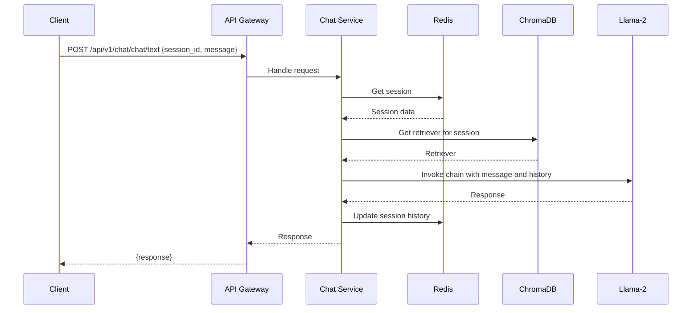

Below is a detailed technical document describing the backend system’s flow, API structure, database interactions, models, vectorization, tokenization, architecture, and parameters. This document is designed to be comprehensive, covering all requested aspects with clarity and precision.

---

## Technical Document: Backend System Overview

### 1. Introduction
The backend system is a conversational AI platform designed to process user requests, maintain session context, and generate intelligent responses. It leverages modern technologies such as **FastAPI** for the API layer, **Redis** for session management, **ChromaDB** for vector storage, and **Llama-2** for text generation, ensuring efficient and context-aware interactions.

---

### 2. Architecture Overview
The system follows a modular architecture where each component handles a specific responsibility. Below is a high-level description of the components and a textual representation of the architecture diagram.

#### Components:
- **Client**: The frontend (e.g., web or mobile app) that sends requests to the backend.
- **API Gateway**: Built with **FastAPI**, it receives and routes incoming requests.
- **Chat Service**: Processes chat requests, integrating models and context retrieval.
- **Session Manager**: Manages session data, stored in **Redis**.
- **Vector Store**: Handles document embeddings using **ChromaDB** for context retrieval.
- **Models**: Includes **Llama-2** for text generation and an embedding model for vectorization.

#### Architecture Diagram (Textual Representation):
```
[Client] <--> [API Gateway (FastAPI)] <--> [Chat Service] <--> [Models (Llama-2, Embeddings)]
                                            |
                                            v
                                       [Session Manager] <--> [Redis]
                                            |
                                            v
                                       [Vector Store] <--> [ChromaDB]
```
*Note*: For a visual diagram, use tools like **draw.io** or **Lucidchart** to create a graphical representation based on this structure.

---

### 3. API Structure
The API is built using **FastAPI** and provides endpoints to manage sessions and process chat requests. Each endpoint is stateless, relying on session IDs to maintain context.

#### Endpoints:
1. **POST /api/v1/chat/session**
   - **Description**: Creates a new session.
   - **Parameters**: None
   - **Response**: 
     ```json
     { "session_id": "uuid" }
     ```
   - **Purpose**: Initializes a session for tracking conversation history.

2. **POST /api/v1/chat/chat/text**
   - **Description**: Processes a user’s chat message and returns an AI response.
   - **Parameters**:
     ```json
     {
       "session_id": "uuid",    // Unique session identifier
       "message": "user input"  // User’s text message
     }
     ```
   - **Response**:
     ```json
     { "response": "AI response" }
     ```
   - **Purpose**: Handles the core chat functionality.

---

### 4. Database Interactions
The system uses two databases: **Redis** for session management and **ChromaDB** for vector storage.

#### Redis (Session Management)
- **Purpose**: Stores session data, including chat history and metadata.
- **Schema**: Each session is a JSON object with the following structure:
  ```json
  {
    "session_id": "uuid",
    "history": [
      {"user": "Hello", "ai": "Hi there!"},
      {"user": "How are you?", "ai": "I'm good, thanks!"}
    ],
    "metadata": {
      "created_at": "timestamp",
      "last_updated": "timestamp"
    }
  }
  ```
- **Operations**:
  - `create_session`: Initializes a new session.
  - `get_session`: Retrieves session data by ID.
  - `add_chat_history`: Appends a user-AI message pair to the history.

#### ChromaDB (Vector Storage)
- **Purpose**: Stores document embeddings for context-aware responses.
- **Schema**: Organized into collections with the following structure:
  - **Collection Name**: Customizable (e.g., `chat_documents`).
  - **Fields**: 
    - `embedding`: 384-dimensional vector (from the embedding model).
    - `metadata`: Includes `chat_id` (session ID) for filtering.
    - `document`: Original text content.
- **Operations**:
  - `get_retriever`: Fetches relevant documents based on a query and session ID.

---

### 5. Model Usage
The system uses two primary models: **Llama-2** for text generation and an embedding model for vectorization.

#### Llama-2 (Text Generation)
- **Description**: A 7B parameter model quantized to 4-bit (`Q4_K_M.gguf`) for efficient inference.
- **Library**: Loaded using `LlamaCpp`.
- **Configuration**:
  - `n_gpu_layers=-1`: Offloads all layers to the GPU (if available).
  - `n_batch=512`: Batch size for token processing.
  - `n_ctx=2048`: Context window size (maximum tokens the model can process).
- **Purpose**: Generates human-like responses based on user input and context.

#### Embedding Model (Vectorization)
- **Description**: `all-MiniLM-L6-v2` from Hugging Face, producing 384-dimensional vectors.
- **Library**: Integrated via `langchain_huggingface.HuggingFaceEmbeddings`.
- **Purpose**: Converts text (documents and queries) into vectors for storage and retrieval.

---

### 6. Vectorization and Tokenization
#### Vectorization
- **Process**: Documents and user queries are embedded using the `all-MiniLM-L6-v2` model.
- **Output**: 384-dimensional vectors stored in **ChromaDB**.
- **Role**: Enables similarity-based retrieval of relevant context for chat responses.

#### Tokenization
- **Process**: Handled internally by `LlamaCpp` for the **Llama-2** model.
- **Method**: Uses a custom tokenizer optimized for Llama-2’s architecture.
- **Role**: Converts text into tokens for model input, respecting the `n_ctx=2048` limit.

---

### 7. Flow Chart
Below is a detailed flow of a typical chat request through the system.

#### Request Flow:
1. **Client**: Sends `POST /api/v1/chat/chat/text` with `{ "session_id": "uuid", "message": "user input" }`.
2. **API Gateway**: Routes the request to the **Chat Service**.
3. **Chat Service**: Retrieves the session from **Redis** using the session ID.
4. **Chat Service**: Queries **ChromaDB** for a retriever filtered by the session ID.
5. **Chat Service**: Constructs a conversational chain with **Llama-2**, using the chat history and retrieved documents.
6. **Llama-2**: Generates a response based on the input and context.
7. **Chat Service**: Updates the session history in **Redis** with the new user-AI message pair.
8. **API Gateway**: Returns the response to the client.

#### Flow Chart (Mermaid Syntax):

*Note*: Use a tool like **Mermaid Live Editor** to render this visually.

---

### 8. Parameters and Configuration
Below are the key parameters and their roles in the system.

#### Llama-2 Parameters
- **`n_gpu_layers=-1`**: Offloads all model layers to the GPU for faster inference (set to 0 for CPU-only).
- **`n_batch=512`**: Number of tokens processed in a single batch, balancing speed and memory usage.
- **`n_ctx=2048`**: Maximum context window size, determining how much history the model can consider.

#### ChromaDB Parameters
- **`collection_name`**: Name of the vector collection (e.g., `chat_documents`).
- **`embedding_function`**: The `all-MiniLM-L6-v2` model used to generate embeddings.
[frontend.md](../frontend/frontend.md)
#### Redis Parameters
- **`SESSION_EXPIRATION`**: Time (in seconds) before a session expires (e.g., 3600 for 1 hour).

---

### 9. Conclusion
This backend system integrates **FastAPI**, **Redis**, **ChromaDB**, and **Llama-2** to deliver a robust conversational AI platform. It efficiently handles session management, context retrieval, and response generation. Future enhancements could include optimizing retrieval speed in **ChromaDB** or fine-tuning **Llama-2** for domain-specific tasks.

---

This document provides a complete technical overview of the backend system, including its flow, API, databases, models, vectorization, tokenization, architecture, and parameters. For visual aids, refer to the textual descriptions and use diagramming tools as suggested. Let me know if you need further details!